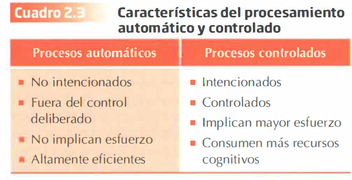
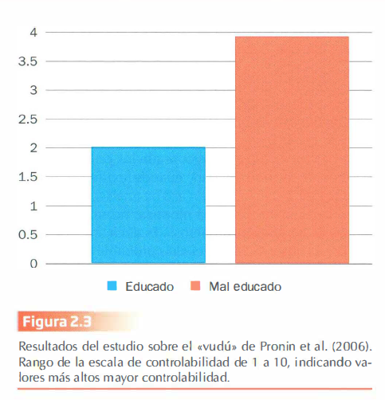
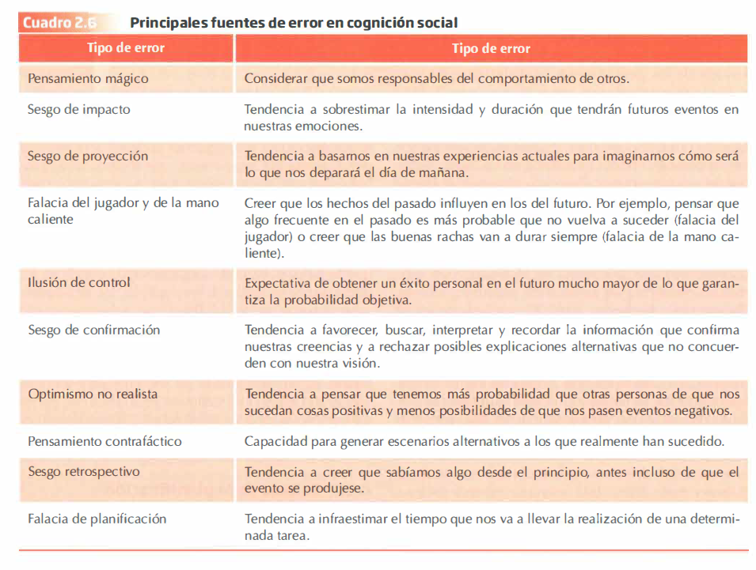
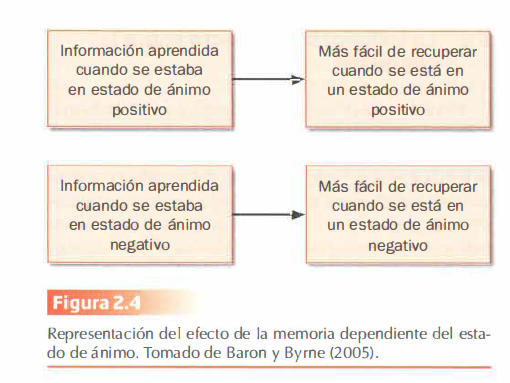
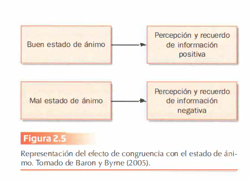

--- 
title: "Resumen del Tema 2 de Psicología Social"
subtitle: "Cognición Social"
author: ""
date: "`r Sys.Date()`"
site: bookdown::bookdown_site
documentclass: book
bibliography: [book.bib, packages.bib]
# url: your book url like https://bookdown.org/yihui/bookdown
# cover-image: path to the social sharing image like images/cover.jpg
description: |
 Este resumen del tema es sólo para uso como material de apoyo en las tutorías. Para estudiar y preparar el examén  se recomienda usar el libro referenciado en la guía de la asignatura.
link-citations: yes
github-repo: dalarconrub/psicologia-social-tema-2

output:
  prettydoc::html_pretty:
    theme: hpstr
    highlight: github
    toc: true
   
---

# Psicología Social {.unnumbered #book}

*Este resumen del tema es sólo para uso como material de apoyo en las tutorías. Para estudiar y preparar el examén  se recomienda usar el libro referenciado en la guía docente de la asignatura.*

# TEMA 2: COGNICIÓN SOCIAL 

La **cognición social** estudia la manera en que interpretamos, analizamos, recordamos y empleamos la información sobre el mundo social.

## 1. Procesamiento Automático y Controlado en el Pensamiento Social  

El procesamiento de la información se puede dar de manera **automática** o **controlada**, y se distinguen por la **intencionalidad**, el **control**, el **esfuerzo** y la **eficiencia**.

### Procesamiento Automático:

- Ocurre **sin** que las personas sean **conscientes** de ello.  
- Es difícil o imposible **evitar o interrumpir** pensamientos una vez activados.
- No implica **esfuerzo**, ya que se basa en estructuras de conocimiento almacenadas en la memoria.
- Es altamente **eficiente** y requiere pocos recursos cognitivos.
- Puede ocurrir **simultáneamente** con otros procesos.
- Aparece **después de una amplia experiencia** con una tarea o información (por ejemplo: conducir o no poder recordar un nombre, pero el pensamiento sigue trabajando mientras haces otra tarea).

#### Ejemplo: Dijksterhuis y van Olden (2006)

| **Experimento sobre el procesamiento automático en la toma de decisiones** |
| - |
| Se formaron tres grupos y a todos se les mostró un póster para decidir cuál les gustaba más, con las siguientes condiciones: |
| - **Decisión inmediata**: elegían inmediatamente tras ver el póster. |
| - **Pensamiento consciente**: después de ver los pósters, reflexionaban escribiendo sus pensamientos antes de elegir. |
| - **Pensamiento no consciente**: tras ver los pósters, realizaban una tarea distractora (resolver anagramas) antes de elegir. |
| Luego se les preguntó por su grado de satisfacción y por cuánto venderían el póster. |
| **Resultado**: Los participantes que eligieron de forma automática (pensamiento no consciente) tomaron mejores decisiones, reflejadas en mayor satisfacción y precio más alto para vender el póster. No pensar demasiado puede reflejar preferencias reales más claramente. |

")

### Ejemplo de Framing: Información más Atractiva

| **Técnica de Framing en la Publicidad** |
| - |
| El **framing** es una técnica utilizada para hacer que la información parezca más atractiva dependiendo de cómo se presenta. |
| Por ejemplo, en publicidad: _¿prefieres comer un 10% de grasa o un 90% de carne magra?_ Resulta más apetecible el 90% de carne magra. |
| Las personas también tienden a gastar más cuando reciben una bonificación en lugar de un reembolso, ya que un reembolso sugiere la devolución de una pérdida. |

#### Aplicación del Framing en Mensajes de Salud

En los mensajes de salud, el framing se ha investigado para determinar cuál es la mejor manera de hacerlos más efectivos: ¿es mejor presentarlos como **pérdidas** o como **ganancias** de salud?

- **Ganancias**: es más efectivo para promover **comportamientos preventivos** que previenen el inicio de enfermedades.
  
- **Pérdidas**: es más efectivo cuando se busca motivar **comportamientos de detección** de enfermedades que las personas pueden tener sin saberlo.

### Procesamiento Controlado:

Por otro lado, el **procesamiento controlado** ocurre de forma **consciente** y requiere un **gran esfuerzo**.

# 2. Esquemas Sociales  

Un **esquema** es una estructura cognitiva que representa el conocimiento abstracto que tenemos acerca de un grupo de estímulos que consideramos que tienen algo en común. Los esquemas incluyen sus atributos y las relaciones que se establecen entre ellos.

#### Ejemplo de Esquema:
Cuando te matriculas en la UNED, tienes un esquema sobre cómo funciona la educación a distancia (de forma autónoma y con tutorías en los centros). Toda la información nueva que adquieras se añadirá a estos esquemas.

## Tipos de Esquemas

### Esquemas de Personas y Grupos:
Es el conocimiento almacenado que tenemos sobre individuos específicos (un amigo, compañero de trabajo) o grupos (inmigrantes, mujeres). Este esquema sugiere que ciertos **rasgos y comportamientos** están relacionados, por lo que al ver un individuo o grupo con un rasgo o comportamiento determinado, se activa el esquema asociado a ese individuo/grupo. Ejemplo típico: *Los estereotipos*.

### Esquemas del Yo:
Son estructuras donde almacenamos el conocimiento sobre nosotros mismos. Son **más complejos** que otros esquemas, ya que dedicamos mucho tiempo a pensar sobre nosotros mismos y tenemos un conocimiento muy amplio sobre nuestras destrezas, habilidades, logros, fracasos y preferencias. Ejemplo: *Autoconcepto e identidad*.

### Esquemas de Roles:
Contienen información sobre cómo son o cómo se comportan las personas que ocupan un determinado rol en un grupo o sociedad (profesor, político, líder). Estos esquemas nos permiten comprender o tener **expectativas** sobre las **metas** y **acciones** asociadas a dicho rol, así como sobre cómo interactuar con estas personas.

### Esquemas de Sucesos o Guiones de Acción (Scripts):
Son esquemas que contienen información sobre **secuencias típicas de acciones** en **situaciones concretas** que ocurren con frecuencia y regularidad en un contexto o cultura específicos. Nos ayudan a orientarnos y a comportarnos de manera apropiada en diferentes situaciones.

#### Ejemplos de Scripts:
- **Presentarse a un examen**: mostrar el carné, recoger el examen, buscar el sitio asignado, leer las instrucciones.
- **Restaurante en EE.UU.**: incluye la acción de dejar propina siguiendo un porcentaje establecido.

### Esquemas Abstractos de Resolución de Problemas:
Son esquemas genéricos, libres de contenido específico, que nos proporcionan **procedimientos útiles para solucionar problemas**. Nos indican qué hacer y qué aspectos considerar para encontrar la causa de un suceso. Ejemplo: *Teoría del Balance y Teoría de la Atribución*.

## 1. Influencia de los Esquemas en el Pensamiento Social 

Una vez formados, los **esquemas** (estructuras que organizan el conocimiento) influyen en el pensamiento social a través de **tres procesos básicos**:

### 1. Atención: Cómo Percibimos

- Los esquemas funcionan como un **filtro**: atendemos y percibimos la información que coincide con nuestros esquemas.
- Nos permiten procesar grandes cantidades de información con menos esfuerzo y de forma eficiente.
- **Ejemplo**: Si tienes un esquema sobre la UNED, este te servirá como filtro para seleccionar la información más relevante y estudiar con éxito.

### 2. Codificación: Almacenamiento de la Información

- Tendemos a almacenar información que es consistente con nuestros esquemas.
- La información **inconsistente** no se pierde, sino que puede almacenarse en lugares separados y etiquetarse de manera diferente **en la memoria a largo plazo**.
- **Ejemplo**: En el esquema "presentarse a un examen", si ocurre algo inusual, ese evento se almacenará por ser inconsistente.

### 3. Recuperación: Extracción de la Información

- Es más fácil recordar información que es consistente con nuestras estructuras previas.
- La información inconsistente también se almacena, y podemos recuperarla si el evento fue inconsistente con nuestro esquema.

Los esquemas son útiles para simplificar y organizar la información, pero también pueden producir **distorsiones** en la comprensión del mundo real. Juegan un papel importante en la formación de **estereotipos y prejuicios**. Además, son **resistentes al cambio** y muestran un **efecto de perseverancia**, lo que los hace inalterables incluso ante información contradictoria.

---

### Ejemplo: Profecías Autocumplidas (Efecto Pigmalión)

| **Profecías Autocumplidas** |
| - |
| Las profecías autocumplidas ocurren cuando tenemos una creencia (o predicción) errónea sobre la alta posibilidad de que ocurra un evento futuro, influenciamos nuestra conducta de forma que aumentamos las probabilidades de que ocurra, y finalmente sucede. |

#### Mecanismos:
1. Provocamos que la conducta de otra persona se ajuste a nuestras expectativas.
2. Limitamos el rango de conductas que la otra persona puede realizar.

#### Ejemplo:
En un experimento escolar, se administró una prueba de inteligencia a todos los alumnos. De forma aleatoria (sin tener en cuenta los resultados), se dijo a los profesores que un grupo de alumnos tenía un rendimiento superior al del resto. 
Esta información cambió los esquemas y expectativas de los profesores hacia esos alumnos. Al final del curso, estos alumnos obtuvieron mejores resultados, ya que los profesores los trataron de manera diferente (más atención, tareas más desafiantes, más tiempo para responder), y los estudiantes adaptaron su comportamiento a las expectativas.

## 2. ¿Qué Esquemas Utilizamos?

Los esquemas se **activan** de manera espontánea cuando presenciamos un estímulo relacionado con ellos. La activación de un esquema depende de su **accesibilidad**, es decir, el grado en que los conceptos y esquemas están disponibles en nuestra memoria.

#### Ejemplo:
Podemos tener esquemas **crónicamente activados** en nuestra memoria, como los **esquemas de roles de género**, lo que aumenta la probabilidad de clasificar a las personas según este esquema sin prestar atención a otros aspectos.

### Factores que Determinan la Accesibilidad de los Esquemas:

- **Experiencia pasada**: La **finalidad** de los esquemas es cubrir nuestras lagunas cognitivas basándose en la experiencia previa, más que en la información nueva que nos llega.
  
- **Objetivos y metas personales**: Estos pueden activar o inhibir determinados esquemas.  
  **Ejemplo**: Si en una reunión social el grupo tiene una actitud positiva hacia un grupo, podríamos evitar usar esquemas negativos (prejuicios) para mostrarnos como personas sin prejuicios.

- **Cercanía temporal de la activación de un esquema (priming)**: Facilita que se vuelva a usar el mismo esquema para interpretar nuevos estímulos, incluso en contextos no relacionados.

### Priming

El **priming** se refiere a la activación o disponibilidad de información en la memoria como resultado de la exposición a eventos o estímulos específicos.

### Ejemplo de Priming: Estudio de Bargh et al. (1996)

| **Estudio de Priming** |
| - |
| En este estudio se utilizó el priming para activar rasgos asociados a la "mala educación" y a la "amabilidad". Se dividió a los participantes en tres grupos, y se les dio frases complejas que tenían que descifrar: |
| - Un grupo recibió frases con palabras relacionadas con la **mala educación** (audaz, grosero, descortés…). |
| - Otro grupo recibió palabras relacionadas con la **amabilidad** (cordial, paciente, cortés…). |
| - Un tercer grupo recibió palabras **neutras** (ejercicio, ocasional, rapidez…). |

En la segunda fase del experimento, los participantes debían consultar al experimentador sobre la siguiente tarea a realizar. Sin embargo, al ir a preguntar, el experimentador comenzaba a hablar con un cómplice, ignorando al participante.

#### Objetivo:
El objetivo era comprobar si los participantes interrumpían o no la conversación para recibir instrucciones.

#### Resultados:
- Los participantes interrumpieron en mayor medida cuando se les había activado el rasgo de **"mala educación"**.
- Curiosamente, la **valoración** que hicieron los participantes sobre la **amabilidad** del experimentador no difirió entre los tres grupos.

Este estudio muestra que estas diferencias en el comportamiento ocurren de manera **no consciente** y **automática**, lo que indica que el **procesamiento automático** es un aspecto clave del pensamiento social y puede afectar al comportamiento manifiesto.

#### Unpriming
El **unpriming** es el proceso mediante el cual los pensamientos o acciones activados por una experiencia reciente se eliminan una vez que se expresan. Si los esquemas **no** se expresan, los efectos del esquema activado pueden persistir.

### Experimento: Preguntas Fáciles (Unpriming)

Se realizó un estudio con dos grupos experimentales a los que se les pidió que respondieran a preguntas sencillas de “sí o no” (por ejemplo, ¿cuánto es 1+2?, ¿cuántos lados tiene un triángulo?):

- A un grupo se le pidió que diera una respuesta aleatoria.
- Al otro grupo se le mostró la pregunta dos veces; primero tenían que responder correctamente, y luego, dar una respuesta aleatoria.

**Resultados**:
- El grupo que respondió de manera aleatoria acertó el **58%** de las veces (activación del esquema "responder de forma correcta").
- El grupo que respondió primero de manera correcta y luego aleatoriamente acertó el **49%** de las veces.

**Conclusión**: Cuando los esquemas activados previamente se **expresan**, es posible romper la asociación, y el efecto del esquema desaparece. Sin embargo, si **no se expresan**, los efectos del esquema pueden persistir.

")

# 3. Heurísticos  

Además de los esquemas, otra forma de reducir el esfuerzo en el procesamiento de la información son los **heurísticos**, una serie de reglas sencillas que usamos frecuentemente para **hacer juicios** y **tomar decisiones** sin consumir muchos recursos cognitivos (Tversky y Kahneman, 1974).

Son atajos mentales que generalmente funcionan, pero a veces pueden llevarnos a cometer **errores** lógicos, probabilísticos o racionales.

### 1. Heurístico de Representatividad  

Este heurístico consiste en juzgar la probabilidad de que un evento pertenezca a un determinado conjunto fijándonos en la **similitud** entre el suceso y la categoría. Es un **juicio de similitud** que nos lleva a sobrestimar la probabilidad de que algo (un evento) pertenezca a una categoría.

**Ejemplo**:  
*"Steve es muy tímido e introvertido, siempre servicial, pero con poco interés por las personas del mundo real. Una persona tranquila y ordenada, que necesita del orden y de la estructura y con una gran pasión por el detalle."*  
Se nos pregunta si Steve trabaja como granjero, actor, bibliotecario, buzo o cirujano.

Para dar una respuesta rápida, estimamos el grado en que Steve es representativo de una persona promedio de cada categoría. En este caso, sería bibliotecario, pues su descripción coincide con el estereotipo asociado a los bibliotecarios.

### 2. Heurístico de Simulación  

Este heurístico nos hace creer que algo es más probable solo porque es fácil de imaginar. Lo utilizamos para:

- **Predecir** un hecho futuro.
- **Diagnosticar** la probabilidad de un hecho específico.
- **Calcular** las posibilidades de que ocurra un suceso.

Este heurístico puede llevarnos a pensar en alternativas a hechos o circunstancias pasadas o presentes sobre *qué podría haber ocurrido si hubiésemos hecho algo diferente…* Esto se conoce como **pensamiento contrafáctico** o el error del "¿Y si...?".

**Ejemplo**:  
Mr. Crane y Mr. Tees deben tomar vuelos diferentes pero a la misma hora. Ambos llegan al aeropuerto 30 minutos tarde debido a un atasco. A Mr. Crane le dicen que su vuelo salió a tiempo. A Mr. Tees le informan que su vuelo se retrasó y acababa de salir cinco minutos antes.

**¿Quién está más enfadado?**  
Mr. Tees estará más molesto porque imaginará que podría haber tomado su vuelo si hubiera llegado unos minutos antes, mientras que Mr. Crane sabe que no podría haberlo logrado de ninguna manera.

### 3. Heurístico de Disponibilidad    

Este heurístico se refiere a la tendencia a proporcionar respuestas rápidas basadas en la **facilidad con la que nos viene a la mente la información**.

Lo utilizamos para estimar:

- La **probabilidad** de un suceso.
- La **frecuencia** de una categoría.
- La **aparición conjunta** de dos fenómenos.

**Ejemplo**:  
Si pensamos en los riesgos de viajar en coche o en avión, podríamos creer que volar es más peligroso. Aunque los accidentes de avión son mucho menos frecuentes, tienden a impactar más y son más fáciles de recordar. Sin embargo, las estadísticas muestran que los accidentes de coche causan muchas más víctimas.

### 4. Heurístico de Anclaje y Ajuste  

Este heurístico implica reducir la ambigüedad utilizando como referencia un **punto de partida (ancla)** al que ajustamos nuestra búsqueda de una solución final.

**Ejemplo**:  
Para predecir el número de alumnos en una asignatura el año próximo, tomamos como referencia la cantidad de alumnos matriculados este año.

Este heurístico es relevante en los **estudios de opinión**, ya que cuando las personas responden una escala, tienden a ser influenciadas por los extremos y responden en el punto intermedio. Este punto intermedio se ajusta según el tamaño de la escala (por ejemplo, una escala de 0 a 20 versus una de 0 a 100).

# 4. Errores en la Cognición Social  

Aunque los atajos mentales son efectivos, su uso también puede llevarnos a cometer errores al procesar la información. A pesar de que los llamemos *"errores"*, esto no necesariamente tiene connotaciones negativas, ya que estas **tendencias erróneas** pueden ser **adaptativas** cuando se trata de lidiar con la complejidad del mundo social.

- **Error**: Es una equivocación puntual o circunstancial, normalmente asociada a la desviación de una regla normativa.
- **Sesgo**: Es una tendencia sistemática a cometer una distorsión.

### 1. Pensamiento Mágico  

El **pensamiento mágico** se refiere a las **atribuciones de causalidad** que carecen de lógica o respaldo empírico. Este tipo de pensamiento ocurre cuando creemos que nuestros pensamientos o acciones pueden tener consecuencias en el mundo externo, ya sea por nuestra propia intervención o por fuerzas paranormales.

#### Experimento: "Vudú"

En este experimento, los participantes hacían vudú a otra persona (un cómplice del experimentador) clavándole agujas a un muñeco. Había dos condiciones experimentales, en las cuales el cómplice se comportaba de manera diferente:

- **Detestable**: Llegaba tarde, mascaba chicle con la boca abierta, tiraba papeles al suelo, etc.
- **Agradable y simpática**.

Después, el experimentador pedía al participante que clavara agujas al muñeco, y el cómplice comenzaba a quejarse de dolor de cabeza.

**Objetivo**: Observar si los participantes se sentían más responsables por el dolor de cabeza del cómplice cuando este era "maleducado".

**Resultado**: En la condición "maleducado", los participantes tendieron a sentirse más responsables del dolor de cabeza del cómplice, lo cual sugiere que haber pensado mal de la otra persona influyó en su percepción de control sobre el dolor.

### 2. Sesgo de Impacto  

El **sesgo de impacto** se refiere a la tendencia a sobrestimar la **intensidad y duración** que tendrán futuros eventos sobre nuestras emociones.

El **pronóstico afectivo** son las predicciones que hacemos sobre nuestros sentimientos futuros.

#### Wilson y Gilbert (2003)
Este sesgo muestra cómo nuestras creencias pueden influir en nuestras emociones. Según estos autores, los seres humanos somos poco precisos a la hora de imaginar nuestro futuro emocional. Los principales errores que cometemos incluyen:

- **Errores de valencia**: Cometemos errores al predecir si nuestras emociones futuras serán positivas o negativas.
- **Errores sobre emociones específicas**: Aunque acertemos la valencia (positiva o negativa) de nuestras emociones, no podemos adivinar qué emociones específicas sentiremos.
- **Errores de intensidad**: No solemos predecir correctamente la intensidad de nuestras emociones futuras.
- **Errores de duración**: También fallamos al estimar cuánto durarán nuestros futuros estados emocionales.

#### Experimento: Votantes de Hillary Clinton (Dorison et al., 2019)

Se pidió a los votantes de Hillary Clinton que imaginaran cómo se sentirían después de ver el discurso de investidura de Trump (pronóstico afectivo). Luego, vieron una grabación del discurso.

**Objetivo**: Comparar la predicción de sus emociones con las emociones reales que sintieron.

**Resultado**: El pronóstico afectivo fue de 4.08 (en una escala del 0 al 8), mientras que la emoción real fue de 3.07. Los participantes anticiparon niveles de afecto negativo mucho más altos de lo que realmente experimentaron.

### 3. Sesgo de Proyección  

El **sesgo de proyección** es la tendencia a usar nuestras vivencias presentes para predecir cómo será el futuro (Loewenstein et al., 2003).

#### Ejemplo: "Regreso al Futuro" (Julie Beck para *The Atlantic*)

En la película "Regreso al Futuro", ambientada en 2015, se muestra a personas usando faxes y cabinas telefónicas. Hoy en día sabemos que estos objetos son obsoletos, pero en el momento en que se escribió la película, se proyectó que seguirían existiendo, basando las predicciones futuras en la tecnología del presente.

# 4. Falacia del Jugador y de la Mano Caliente  

## 1. La Falacia del Jugador  

La **falacia del jugador** se refiere a la creencia errónea de que los **sucesos pasados afectan a los futuros en actividades aleatorias**, como los juegos de azar (Tversky y Kahneman, 1971).

Es la tendencia a creer que la **equiprobabilidad** se manifestará en un número reducido de observaciones.

### Ejemplo: Lanzamiento de Moneda  
Imaginemos una secuencia corta de lanzamientos de moneda, donde ambos resultados (cara y cruz) tienen la misma probabilidad de ocurrir. Si en una secuencia de cinco lanzamientos salen cinco veces cara, tendemos a pensar que en los siguientes lanzamientos debería salir cruz para "compensar". Esto es lo **"razonablemente esperable"**, pero no necesariamente es lo correcto.

### Ejemplo: CI de Estudiantes  
Imagina que el **Cociente Intelectual (CI)** promedio de una población estudiantil es de 100. Has seleccionado una muestra de 50 niños, y el primer niño tiene un CI de 150. Si se pregunta cuál se espera que sea la media de CI de la muestra completa, muchas personas responderán que 100. Sin embargo, la respuesta correcta sería 101, ya que el CI del primer niño incrementa levemente la media de la muestra.

**Conclusión**: Las personas tienden a creer en la **"justicia" de las leyes del azar**, pensando que cualquier desviación de la norma se autocorregirá para que el resultado final sea "normal". Sin embargo, en muestras pequeñas no se aplican las **leyes de los grandes números**.

### Teoría de los Grandes Números  
La **teoría de los grandes números** establece que, cuando se tiene una muestra lo suficientemente grande, la media muestral se asemejará a la media poblacional. A medida que aumenta el número de observaciones, nos alejamos de los resultados extremos. Por ejemplo, lanzar una moneda solo tres veces tiene más probabilidades de resultar en el mismo lado que si lanzamos 500 veces. Cuanto más grande es la muestra, más se aproxima al 50% de cara y 50% de cruz.

---

## 2. Falacia de la Mano Caliente  

La **falacia de la mano caliente** es el fenómeno opuesto a la falacia del jugador. Se refiere a la creencia de que, si un jugador ha tenido éxito en una serie de tiros en un corto periodo de tiempo, está en una **mejor disposición para continuar anotando** (Gilovich et al., 1985).

### Estudio: Filadelfia 76ers  
Se analizaron las estadísticas de tiro de los jugadores del equipo de baloncesto Filadelfia 76ers. De los 9 jugadores analizados, 8 tenían **probabilidades más bajas de anotar un tiro después de un acierto (51%) que después de haber fallado (54%)**.

**Conclusión**: La creencia en la "mano caliente" no se sostiene. De hecho, la probabilidad de anotar un tiro después de una "racha" exitosa era más baja que después de una mala racha. Por ejemplo, **después de 3 o 4 aciertos** consecutivos, la probabilidad de anotar el siguiente tiro era del 50%, mientras que **después de 0 o 1 aciertos** en una serie de 4 intentos, la probabilidad subía al 57%.

# 5. Ilusión de Control  

La **ilusión de control** es la **expectativa de obtener un éxito personal** en el futuro mucho mayor de lo que garantiza la probabilidad objetiva (Langer, 1975). Esto ocurre principalmente cuando creemos erróneamente que nuestra habilidad influye en **situaciones de azar**.

### Ejemplo: Venta de Boletos  

En un experimento, se realizó una rifa en dos empresas vendiendo boletos por 1$ cada uno:

- En una empresa, a los empleados se les asignó un número de boleto al azar.
- En la otra, se les permitió elegir su número de boleto.

En una segunda ronda, se informó que alguien en la otra empresa no pudo comprar un boleto, y se pidió a los empleados si estarían dispuestos a vender el suyo.

**Resultado**:  
- Los empleados que **eligieron** su número de boleto pidieron un precio mucho más alto (8.67$ de media) que aquellos a los que se les asignó al azar (1.96$ de media).  
- **Conclusión**: La libre elección llevó a los empleados a creer que su boleto tenía un valor más alto, lo que refuerza la ilusión de control.

---

# 6. Sesgo de Confirmación  

El **sesgo de confirmación** es la tendencia a **favorecer, buscar, interpretar y recordar** información que **confirma nuestras creencias** mientras rechazamos explicaciones alternativas que no coinciden con nuestra visión (Watson, 1960).

### Ejemplo: Algoritmos de Aplicaciones

Los algoritmos de aplicaciones como YouTube favorecen este sesgo al proporcionarnos contenido que cree que nos puede gustar, reforzando nuestras creencias previas y evitando exponernos a opiniones o ideas opuestas.

### Fake News  

El auge de las **fake news** también puede explicarse por este sesgo. Incluso si un argumento es absurdo, si una persona cree en él, tenderá a buscar información que confirme su visión y evitará fuentes oficiales que puedan contradecir sus creencias.

---

# 7. Optimismo No Realista  

El **optimismo no realista** es la tendencia a pensar que tenemos **más probabilidad** que otras personas de que nos sucedan **cosas positivas** y menos probabilidad de que nos ocurran cosas negativas (Weinstein, 1980).

### Estudio: Expectativas de Eventos

En un estudio, se presentó a un grupo de estudiantes una serie de eventos positivos y negativos. Se les pidió que indicaran, del 0 al 100%, cuánto creían que era probable que dichos eventos les ocurrieran a ellos en comparación con otro estudiante del mismo sexo.

**Resultado**:  
- Para los eventos positivos, los estudiantes asignaron una probabilidad media de **15.4%** mayor.
- Para los eventos negativos, asignaron una probabilidad media de **-20.4%**.

**Conclusión**: Este optimismo no realista estaba relacionado con un **menor interés en reducir riesgos**, especialmente en relación con la salud. Los estudiantes que mostraban este sesgo tendían a preocuparse menos por problemas de salud y, en algunos casos, a no tomar medidas preventivas o incluso realizar comportamientos de riesgo.

---

# 8. Pensamiento Contrafáctico  

El **pensamiento contrafáctico** deriva del **heurístico de simulación** y se refiere a la habilidad para generar **escenarios alternativos** a los que realmente han sucedido (Kahneman y Tversky, 1982).

### Estudio: Accidente de Mr. Jones  

En este estudio, se contó a unos estudiantes que Mr. Jones había fallecido en un accidente de tráfico. A un grupo se le dijo que Mr. Jones había salido de trabajar a su hora habitual, mientras que al otro se le informó que había salido un poco antes por un recado extraordinario pedido por su esposa.

**Resultado**:  
- Los estudiantes a los que se les dijo que Mr. Jones había salido antes con mayor frecuencia mencionaron que el accidente no habría ocurrido si hubiera salido a su hora habitual.
- El otro grupo consideró en menor medida que el accidente podría haberse evitado. 

**Conclusión**: Los estudiantes tenían más dificultad para imaginar un escenario alternativo cuando el suceso era cotidiano.

### Estudio: Juegos Olímpicos de Barcelona 1992  

En otro estudio, se mostraron imágenes de los atletas después de competir y durante la entrega de medallas a un grupo de estudiantes. Los videos fueron editados para que no supieran qué medalla habían ganado los deportistas (plata o bronce). Se pidió a los estudiantes que evaluaran las emociones de los deportistas en una escala de 10 puntos.

**Resultado**:  
- Los medallistas de **bronce** puntuaron en 7.1 después de la competición y 5.7 durante la entrega de medallas.
- Los medallistas de **plata** puntuaron en 4.8 después de la competición y 4.3 durante la entrega de medallas.

**Conclusión**: Los medallistas de bronce estaban más satisfechos que los de plata, tanto al final de la competición como en la entrega de medallas.

### Interpretación:  
- **Pensamiento contrafáctico al alza**: Los medallistas de **plata** se comparaban con los que ganaron el oro, y estaban decepcionados por no haber alcanzado el primer puesto.
- **Pensamiento contrafáctico a la baja**: Los medallistas de **bronce** se comparaban con aquellos que terminaron en cuarto lugar y se quedaron sin medalla, lo que les hizo sentir más satisfechos.

---

### Falacia del Primer Impulso  

Esta falacia es otro ejemplo de pensamiento contrafáctico. Se refiere a la tendencia a considerar que **la primera opción** que se escoge es la **correcta**, y existe una gran resistencia a cambiar a otra alternativa.

### Ejemplo: Exámenes  

Un ejemplo clásico es en los **exámenes**, donde incluso los profesores suelen perpetuar esta falacia alentando a los estudiantes a confiar en su primera respuesta. Sin embargo, si durante la revisión de un examen cambiamos una respuesta a una segunda opción incorrecta, solemos pensar *"podría haber acertado si me hubiera quedado con la primera opción"*. El malestar es mayor si la respuesta inicial era incorrecta pero nos negamos a cambiarla.

**Conclusión**: Existen estudios que demuestran que **cambiar de opción** generalmente conduce a **mejores resultados**.

# 9. Sesgo Retrospectivo  

El **sesgo retrospectivo** es la tendencia a **creer que sabíamos algo desde el principio**, incluso antes de que el evento ocurriera (Fischoff y Beyth, 1975).

### Estudio: Visita de Nixon a China y la URSS

En 1972, se preguntó a un grupo de personas en EE. UU. qué acontecimientos creían que sucederían tras la visita del presidente Nixon a China y la URSS. Los participantes asignaron una probabilidad a una serie de eventos ya formulados (por ejemplo: "Mao Zedong estaría dispuesto a recibir a Nixon" o "China obtendría reconocimiento diplomático por EE. UU.").

**Resultado**:  
- Tras las visitas, se les volvió a preguntar qué probabilidades habían asignado a esos eventos.
- Cuando un acontecimiento efectivamente había ocurrido, los participantes **exageraban** la probabilidad que creían haber dado inicialmente.
  
**Ejemplo**: Exageraban la probabilidad que creían haber asignado a la posibilidad de que EE. UU. y la URSS crearan un programa espacial, evento que efectivamente ocurrió, aunque en ese momento era difícil de imaginar debido a la Guerra Fría.

---

# 10. Falacia de la Planificación  

La **falacia de la planificación** es la tendencia a **subestimar el tiempo** que nos llevará realizar una tarea. Esto ocurre porque, al planificar, adoptamos una **perspectiva interna**, centrada en los pasos que vamos a seguir para completar el objetivo, sin tener en cuenta variables externas que pueden afectar al desarrollo del plan (Tversky y Kahneman, 1979).

### Ejemplo: Construcción de un Edificio  

El jefe de obra puede conocer perfectamente el plan para entregar los pisos a tiempo, pero no puede prever factores externos como la disponibilidad de materiales, huelgas o condiciones climáticas adversas.

### Solución: Perspectiva Externa  

Una posible solución a esta falacia es adoptar una **perspectiva externa**: fijarnos en el tiempo que han tardado proyectos similares al nuestro en ser completados.

### Estudio: Trabajo de Fin de Grado (TFG)  

Se realizó un estudio con estudiantes que iban a entregar su TFG, preguntándoles cuánto tiempo creían que tardarían en entregarlo. A un grupo se le pidió que estimara el tiempo "en el mejor de los casos (optimista)" y predijeron una media de 27.4 días. Al otro grupo se le pidió que estimara el tiempo "en el peor de los casos (pesimista)" y predijeron 48.6 días.

**Resultado**:  
- La media de entrega fue de **55.5 días**, lo que resultó en una discrepancia de 28.1 días con los optimistas y 6.9 días con los pesimistas.
  
**Conclusión**: Los estudiantes **subestimaron el tiempo** que les llevaría completar el TFG, especialmente aquellos que creían que todo saldría según lo planificado.

# 5. Relación entre el Afecto y la Cognición  

La forma en que **sentimos** moldea y contribuye a cómo **pensamos**. Por ejemplo, cuando estamos de buen humor, percibimos a las personas de un modo más favorable e interpretamos los eventos de manera más positiva. Lo mismo ocurre a la inversa: si salimos enfadados de un examen, podemos llevar ese estado de ánimo al mundo social.

Estudiaremos la **interacción** entre el **afecto** y la **cognición**:

- **Afecto**: estado de ánimo actual.
- **Cognición**: la forma en que procesamos la información.
- **Interacción**: la relación es **doble** → los sentimientos influyen en la cognición, y la cognición influye en el estado de ánimo.

## 1. La Influencia del Afecto sobre la Cognición  

El estado de ánimo influye en los **juicios sociales** que hacemos sobre nosotros mismos y los demás (estado de ánimo positivo = juicios positivos). También influye en la forma en que **respondemos** a **estímulos** (personas, situaciones, circunstancias) y cómo **recordamos hechos pasados**.

### Tipos de Influencia del Afecto sobre la Memoria:

1. **Memoria dependiente del estado de ánimo**: La información que recordamos mientras estamos en un determinado estado emocional puede estar influida por el estado de ánimo que teníamos cuando se almacenó.  
   *(Por ejemplo: si almacenamos información estando de buen humor, es más probable que accedamos a esa información cuando estamos de buen humor)*.

   - Durante las vacaciones, es más probable que recordemos anécdotas de vacaciones pasadas.
   

2. **Efecto de congruencia con el estado de ánimo**: Percibimos y recordamos la información que es congruente con nuestro estado emocional: positiva cuando estamos de buen humor y negativa cuando estamos de mal humor.  
   *(Este efecto ha recibido mayor apoyo experimental: Fiske y Taylor, 1991)*.

### Diferencia entre ambos efectos:
- En la **memoria dependiente del estado de ánimo**, no importa la naturaleza positiva o negativa de la información. Si, por ejemplo, pasamos una semana encerrados en casa y no nos sentimos bien, podemos recordar la satisfacción que nos daban las videollamadas con amigos.
- En el **efecto de congruencia**, la naturaleza afectiva de la información (positiva o negativa) sí es relevante.

Efecto de congruencia con el estado de ánimo

## Otros Efectos del Afecto sobre la Cognición:

- **Creatividad**: El estado de ánimo positivo incrementa la creatividad, generando una mayor activación de ideas y asociaciones que cuando el estado de ánimo es negativo.
- **Uso de heurísticos**: Tendemos a utilizar más heurísticos cuando estamos de buen humor que cuando estamos de mal humor.
- **Atribuciones**:
  - Atribuciones sobre los demás: Tendemos a atribuir conductas positivas a otras personas cuando estamos de buen humor.
  - Atribuciones sobre nosotros mismos: Las personas deprimidas tienden a atribuir los eventos negativos a su infelicidad (*todo lo malo me sucede a mí…*).

La información que provoca **reacciones afectivas** puede procesarse de manera diferente y ser **más difícil de ignorar**, lo que puede convertirse en una fuente de **contaminación mental** (Edwards y Bryan, 1997).

### Contaminación Mental:

La **contaminación mental** es el proceso por el cual nuestros juicios, emociones o comportamientos están influenciados por pensamientos mentales que son inconsistentes o incontrolables.

### Experimento: Jurado (Edwards y Bryan)

En este experimento, los participantes actuaban como jurados en un caso de intento de asesinato. A un grupo de jurados se les presentó el caso con detalles que generaban fuertes emociones, mientras que a otro grupo se le presentó de manera neutral. Al momento de emitir un veredicto, a una parte se les pidió que **ignoraran** la información emocional, mientras que a la otra se les pidió que la **tuvieran en cuenta**.

**Resultados**:

- Los jurados a quienes se les pidió que ignoraran la información emocional pensaron en ella con más frecuencia.
- Las sentencias fueron más severas en el grupo que recibió la información emocional y se les pidió que la ignoraran.

**Conclusión**: Pedir a un jurado que ignore información emocional puede tener consecuencias no deseadas en el veredicto final.

## 2. La Influencia de la Cognición sobre el Afecto  

A la inversa del punto anterior, existen algunos **mecanismos** por los cuales las cogniciones influyen en el estado de ánimo:

### 1. Teoría de los Dos Factores de la Emoción (Schachter)  

A veces es difícil identificar cómo nos sentimos, por lo que inferimos la naturaleza de estos sentimientos a partir de las situaciones en las que experimentamos las reacciones. Por ejemplo, si sentimos activación antes de un examen, inferimos que es ansiedad y no miedo.

### 2. Activación de Esquemas con un Fuerte Componente Afectivo  

La activación de ciertos **esquemas** puede influir en nuestro estado emocional.  
**Ejemplo**: La activación de un estereotipo sobre un grupo puede provocarnos miedo si el estereotipo está asociado a la delincuencia, mientras que otros estereotipos pueden despertar simpatía.

### 3. Los Esfuerzos por Regular Nuestras Emociones y Sentimientos  

Existen **mecanismos cognitivos** para regular nuestros sentimientos, tales como:

#### a. Creer Firmemente que "Nunca Se Tuvo la Oportunidad"  

Esta creencia ayuda a que los resultados negativos parezcan **inevitables** y, por lo tanto, menos estresantes (Tykocinsci, 2001).

#### b. Caer en la Tentación  

Cuando nos sentimos tristes o deprimidos, tendemos a realizar actividades que creemos que nos harán sentir mejor, como **comer alimentos no saludables** o **holgazanear**. Estas conductas son una respuesta a la **angustia emocional**, que reduce nuestra capacidad o motivación para controlar los impulsos de hacer cosas placenteras, pero con consecuencias negativas.

- Esta elección **no es automática**, sino **estratégica**: son conductas empleadas para reducir los sentimientos negativos de la angustia.

#### c. Error de Pronósticos Afectivos  

Los pronósticos afectivos se basan en una forma diferente de procesar la información en comparación con la **experiencia emocional real**.

### Experimento: Noticia sobre Incendios (Dunn y Ashton-James, 2008)

Los participantes fueron divididos en dos grupos:

- El grupo **experimentador de la emoción** leyó una noticia sobre un incendio forestal mortal en España y se les pidió que informaran sobre sus emociones mientras leían.
- El grupo **pronosticador de la emoción** debía predecir cómo se sentirían si se enteraran de una noticia sobre un incendio forestal mortal en España.

Se varió también el número de víctimas en la noticia: 5 personas o 10,000 personas.

**Resultados**:  
- El número de víctimas afectó significativamente al estado emocional del grupo **pronosticador**, mostrando mayor sensibilidad por la tragedia cuando el número de víctimas era mayor.
- Sin embargo, en el grupo **experimentador**, el número de víctimas no afectó significativamente su estado emocional.

**Conclusión**:  
Las emociones están más basadas en **imágenes concretas** y **experiencias inmediatas**. La magnitud de la tragedia afectó al grupo de **pronosticadores**, pero no al grupo de **experimentadores**, quienes basaron sus respuestas en la lectura real del suceso.

## Glosario del Tema 2: Cognición Social

Aquí tienes un glosario de los términos clave encontrados en los textos proporcionados para el Tema 2: Cognición Social:

* **Cognición social:** Estudia cómo las personas interpretan, analizan, recuerdan y utilizan la información sobre el mundo social. Busca comprender los procesos que utilizamos para pensar y dar sentido a lo que percibimos de los demás, de nosotros mismos y de las situaciones sociales.

* **Procesamiento automático:** Tipo de procesamiento de la información que se produce sin intención consciente, no está sujeto al control deliberado, no implica esfuerzo y es altamente eficiente. Se basa en estructuras de conocimiento ya almacenadas en la memoria, como los esquemas.

* **Procesamiento controlado:** Tipo de procesamiento de la información que se produce de forma consciente, exige un gran esfuerzo, requiere más recursos cognitivos y es más lento.

* **Esquemas sociales:** Estructuras cognitivas independientes que representan el conocimiento abstracto que tenemos sobre un grupo de estímulos, incluyendo sus atributos y las relaciones entre ellos.
    * **Tipos de esquemas:**
        * **De personas y grupos:** Conocimiento sobre individuos o grupos específicos, asociando rasgos y comportamientos.
        * **Del yo:** Estructuras que almacenan información sobre nosotros mismos, incluyendo destrezas, habilidades, logros, fracasos y preferencias.
        * **De roles:** Información sobre cómo son y se comportan las personas que ocupan un determinado rol en un grupo o sociedad.
        * **De sucesos o guiones de acción (scripts):** Información sobre secuencias típicas de acciones en situaciones concretas.
        * **Abstractos de resolución de problemas:** Esquemas genéricos que indican procedimientos para solucionar problemas.

* **Influencia de los esquemas:**
    * **Atención:** Los esquemas actúan como filtros, dirigiendo la atención a la información consistente con ellos.
    * **Codificación:** Tendencia a almacenar información consistente con los esquemas. La información inconsistente puede almacenarse en lugares separados.
    * **Recuperación:** Es más fácil recordar información consistente con los esquemas.

* **Accesibilidad de los esquemas:** El grado en que los esquemas están disponibles en la memoria, determinado por la experiencia pasada, los objetivos personales y el priming.
    * **Priming:** Activación de información en la memoria como resultado de la exposición a eventos o estímulos específicos.
    * **Unpriming:** Proceso por el que los pensamientos o acciones primados se eliminan una vez que se expresan.

* **Heurísticos:** Reglas sencillas que se utilizan para hacer juicios y tomar decisiones sin consumir muchos recursos cognitivos.
    * **Representatividad:** Juzgar la probabilidad de un evento basándose en su similitud con una categoría.
    * **Simulación:** Estimar la probabilidad de un evento en función de la facilidad para imaginarlo.
    * **Disponibilidad:** Estimar la probabilidad de un evento en función de la facilidad con la que se recuerda información relevante.
    * **Anclaje y ajuste:** Reducir la ambigüedad tomando como referencia un punto de partida (ancla).

* **Errores en la cognición social:**
    * **Error:** Equivocación puntual o circunstancial.
    * **Sesgo:** Tendencia sistemática a cometer una distorsión.

* **Pensamiento mágico:** Atribuciones de causalidad sin respaldo empírico, creyendo que los pensamientos pueden influir en el mundo externo.

* **Sesgo de impacto:** Sobrestimar la intensidad y duración de las emociones futuras.
    * **Pronóstico afectivo:** Predicciones sobre los sentimientos futuros.

* **Sesgo de proyección:** Usar las experiencias del presente para predecir el futuro.

* **Falacia del jugador:** Creer erróneamente que los sucesos pasados afectan a los futuros en actividades aleatorias.
    * **Teoría de los grandes números:** La media muestral se parecerá a la poblacional en muestras grandes.

* **Falacia de la mano caliente:** Creer que una buena racha en actividades aleatorias continuará.

* **Ilusión de control:** Expectativa de éxito personal mayor de lo que la probabilidad objetiva garantiza.

* **Sesgo de confirmación:** Favorecer la información que confirma las creencias previas.

* **Optimismo no realista:** Pensar que es más probable que sucedan cosas positivas y menos probable que sucedan cosas negativas en comparación con otras personas.

* **Pensamiento contrafáctico:** Generar escenarios alternativos a los que realmente han sucedido.
    * **Falacia del primer impulso:** Considerar que la primera opción es la correcta y resistirse a cambiar de opinión.

* **Sesgo retrospectivo:** Creer que se sabía algo desde el principio, incluso antes de que ocurriera.

* **Falacia de la planificación:** Infraestimar el tiempo que se necesita para completar una tarea.
    * **Perspectiva interna:** Centrarse en los pasos a seguir para completar una tarea sin considerar variables externas.
    * **Perspectiva externa:** Considerar el tiempo que han tardado otros proyectos similares en completarse.

* **Relación entre afecto y cognición:**
    * **Afecto:** Estado de ánimo actual.
    * **Cognición:** Forma en que se procesa la información.
    * **Interacción:** Influencia mutua entre el afecto y la cognición.

* **Influencia del afecto sobre la cognición:**
    * **Efecto de la memoria dependiente del estado de ánimo:** Recordar información que es congruente con el estado de ánimo actual.
    * **Efecto de congruencia con el estado de ánimo:** Percibir y recordar información congruente con el estado de ánimo actual.
    * **Contaminación mental:** Juicios, emociones o comportamientos influenciados por un pensamiento incontrolable.

* **Influencia de la cognición sobre el afecto:**
    * **Teoría de los dos factores de la emoción:** Inferir las emociones a partir de las situaciones en las que se experimentan las reacciones.

* **Mecanismos cognitivos para regular las emociones:**
    * **"Nunca tuve la oportunidad":** Considerar los resultados negativos como inevitables para reducir el estrés.
    * **"Caer en la tentación":** Realizar actividades placenteras para reducir la angustia emocional, aunque tengan consecuencias negativas.
    * **Pronósticos afectivos:** Hacer predicciones sobre los sentimientos futuros.

Este glosario resume los conceptos clave del Tema 2. La comprensión de estos términos facilitará el análisis de la cognición social y su impacto en el comportamiento humano.

