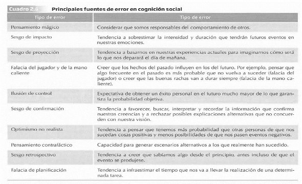

--- 
title: "Resumen del Tema 2 de Psicología Social"
subtitle: "Cognición Social"
author: ""
date: "`r Sys.Date()`"
site: bookdown::bookdown_site
documentclass: book
bibliography: [book.bib, packages.bib]
# url: your book url like https://bookdown.org/yihui/bookdown
# cover-image: path to the social sharing image like images/cover.jpg
description: |
 Este resumen del tema es sólo para uso como material de apoyo en las tutorías. Para estudiar y preparar el examén  se recomienda usar el libro referenciado en la guía de la asignatura.
link-citations: yes
github-repo: rstudio/bookdown-demo

output:
  prettydoc::html_pretty:
    theme: hpstr
    highlight: github
    toc: true
   
---

# Psicología Social {.unnumbered #book}

*Este resumen del tema es sólo para uso como material de apoyo en las tutorías. Para estudiar y preparar el examén  se recomienda usar el libro referenciado en la guía docente de la asignatura.*

# TEMA 2: COGNICIÓN SOCIAL 

La cognición social estudia la manera en que interpretamos, analizamos, recordamos y empleamos la información sobre el mundo social. 

# 1. PROCESAMIENTO AUTOMÁTICO Y CONTROLADO EN EL PENSAMIENTO SOCIAL  

El procesamiento de la información se puede dar de una manera automática o controlada donde la **intencionalidad**, el **control**, el **esfuerzo** y la **eficiencia** son las características que los diferencian.

El **procesamiento automático:  **

- Se produce **sin** que las personas sean **conscientes** de ello.  
- Resulta difícil o imposible **evitar o interrumpir** ciertos pensamientos que ya se han activado.
- **No**  implica  ningún  **esfuerzo**,  puesto  que  se  basa  en  estructuras  de conocimiento que ya están almacenadas en la memoria. 
- Es altamente **eficiente**, requiere pocos recursos cognitivos.
- Puede ocurrir **simultáneamente** a otros procesos.
- Ocurre **después de una amplia experiencia** con una tarea o información *(ej: conducir o no poder recordar un nombre y nuestro pensamiento siga trabajando en ello a pesar de estar haciendo otra tarea) *

 
|POSTERS: Dijksterhuis y van Olden (2006) |
| - |
| Experimento  en  el  cual  se  comprobaba  cómo  el  procesamiento  automático  puede  ayudarnos a tomar decisiones adecuadas. Para ello, se formaron 3 grupos donde a todos les mostraba un poster y después se les hacia decidir cuál les gustaba más para después quedárselo. A cada grupo se les dio una condición experimental:
 - Decisión inmediata: se mostraba el poster y decidían de forma inmediata sobre sus preferencias. 
 - Pensamiento  consciente: se mostraban los posters una vez y después de verlos, tenían un tiempo para  reflexionar  su elección  escribiendo sus pensamientos y evaluaciones en un papel.
 - Pensamiento  no  consciente:  una  vez  vistos  los  posters,  realizaban  una  tarea diferente como resolver anagramas, para evitar reflexionar sobre lo que habían visto. Después se les preguntaba sobre su poster favorito.
 En una segunda fase del experimento, se les llamó a los participantes preguntándoles por su grado de satisfacción con su elección y el precio por el que venderían el poster.
 RESULTADO: los participantes tomatón mejores decisiones (satisfacción y mayor precio otorgado) cuando eligieron de  forma automática, ya que, no pensar demasiado en algo puede reflejar nuestras preferencias reales de una forma más clara.
|

Por otro lado, el  **procesamiento controlado**, se produce de forma consciente y requiere de un gran esfuerzo.

 
 
 

|FRAMING: información más atractiva |
| - |
||
| La publicidad es un sector donde se emplea constantemente la técnica del framing, donde  la información se “encuadra”: *¿prefieres comer un 10% de grasa o un 90% de carne nagra?* Resulta más apetecible un 90% de carne magra.

 Las personas gastan más dinero cuando se devuelve una cantidad de dinero en forma de bonificación que como reembolso, ya que un reembolso connota la devolución de una pérdida de nuestro propio dinero.
 
 En los  mensajes de salud se ha investigado al respecto para hacerlos más efectivos ¿es mejor presentarlos como pérdidas o ganancias de salud?
 
 - GANANCIAS: más efectivo si se incide en comportamientos que previenen el inicio de una enfermedad. 
 
 - PÉRDIDAS:  más  efectivo  cuando  se  enfoca  en  comportamientos  que  detectan enfermedades que las personas pueden tener, pero que no son conscientes. 
|

# 2. ESQUEMAS SOCIALES  

Un **esquema** es una estructura cognitiva independiente que representa el   conocimiento abstracto que tenemos a cerca de un grupo de estímulos, que consideramos que tienen algo en común y que incluye sus atributos y las relaciones que se establecen entre ellos.

Esquema sobre la UNED: cuando te matriculas tienes un esquema sobre cómo  funciona la educación a distancia (de forma autónoma y tutorías en los centros) y toda la información la irá añadiendo en esos esquemas.

**Tipos de esquemas:** 

ESQUEMAS  DE  PERSONAS  Y  GRUPOS:  es  el  conocimiento   almacenado  que  tenemos  sobre  individuos  específicos  (un  amigo,  

compañero  de  trabajo…)  o  grupos  (inmigrantes,  mujeres…).  Este  esquema  sugiere  que  ciertos  **rasgos  y  comportamientos**  están  unidos,  por  lo  que  si  se  presencia  a  un  individuo/grupo  con  un  rasgo  o comportamientos  se  activa  el  esquema  que  tenemos  asociado  a  dicho individuo/grupo. *Los estereotipos.* 

ESQUEMAS DEL YO: estructuras donde almacenamos el conocimiento  sobre nosotros mismos. Son **mucho más complejos** ya que se dedica mucho  tiempo  a  pensar  sobre  nosotros  mismos  y  tenemos  un conocimiento  muy  amplio  sobre  nuestras  destrezas  y  habilidades, logros y fracasos y preferencias. *Autoconcepto e identidad.*   

ESQUEMAS DE ROLES: contienen información sobre cómo son o se   comportan  las  personas  que  ocupan  un  determinado  rol  en  un  grupo  o  sociedad  (profesor,  político,  líder…).  Nos  permiten  comprender  o  tener  **expectativas**  sobre  las  **metas**  y  **acciones**  asociadas a dicho rol y sobre cómo interactuar con ellos. 

ESQUEMAS DE SUCESOS O GUIONES DE ACCIÓN (SCRIPTS): se tratan  de información sobre  **secuencias típicas de acciones** en  **situaciones concretas**,  que  ocurren  frecuentemente  y  con  regularidad  en  un contexto  o  cultura  determinados.  Nos  permiten  orientarnos  en  diferentes situaciones y comportarnos de forma apropiada en ellas.

Esquema *presentarse a un examen:* mostrar el carné, recoger el examen, buscar el sitio  asignado, leer las instrucciones…

Esquema *restaurante EEUU:* serie de acciones que incluyen dejar propina de acuerdo a un porcentaje concreto.

ESQUEMAS  ABSTRACTOS  DE  RESOLUCIÓN  DE  PROBLEMAS:  Son   esquemas  genéricos,  libres  de  contenido  concreto,  sobre  **procedimientos  útiles  para  solucionar  problemas**  ya  que  nos  indican qué hacer y qué aspectos tener en cuenta apara encontrar la  causa de un suceso. *Teoría del Balance y Teoría de la Atribución*[^3]*.* 

1. Influencia de los esquemas en el pensamiento social 

Una vez formados los esquemas (estructuras que organizan el conocimiento), éstos influyen en el pensamiento social mediante **tres procesos básicos**: 

1. LA ATENCIÓN: modo en que ***percibimos***.   
- Los esquemas funcionan a modo de  **filtro**: se atiende y  percibe  la  información  que  coincide  con  nuestros  esquemas.  

- Cuando se maneja mucha información al mismo tiempo, nos permite procesar la información con menos esfuerzo y de forma eficiente. 
- *Ej: si te formas un esquema de la UNED, te servirá de filtro para guiarte  seleccionando  la  información  más  relevante  para estudiar con éxito.* 

2. LA CODIFICACIÓN: información almacenada en la memoria.  

- Tendencia  a  almacenar  la  información  consistente  con  nuestros esquemas.  

- La información  **inconsistente** → no se pierde, se puede almacenar en  lugares  separados  con  una  etiqueta  diferente  **dentro  de  la memoria a largo plazo**. 
- *Ej: esquema “presentarse un examen” si sucede algo inusual,* *ese evento se almacenará por lo inconsistente.* 
  
3. LA RECUPERACIÓN: proceso de **extracción de la información**  que tenemos almacenada en la memoria.  

- Es más fácil que recordemos la información consistente  con las estructuras previas. 

- La información inconsistente permanece almacenada en la memoria y podremos recuperar el vento que resultó inconsistente con nuestro esquema. 

Los esquemas son de gran utilidad a la hora de simplificar y organizar información, sin embargo, pueden producir **distorsiones** en la comprensión del mundo real: los esquemas juegan un papel importante a la hora de los  estereotipos y prejuicios. Además, son muy **resistentes al cambio** y muestran un **efecto de perseverancia** que los hace inalterables incluso frente a información contradictoria.

|PROFECÍAS AUTOCUMPLIDAS (Efecto Pigmalión) |
| - |
| Las profecías autocumplidas se definen como las situaciones en las que las personas tenemos una  creencia (predicción) errónea sobre la alta posibilidad de que ocurra cierto acontecimiento en el futuro, que  influenciamos  nuestra  conducta  para  aumentar  las  probabilidades  de  que  ocurra,  y  termine sucediendo. 

 Existen dos mecanismos: 

 - Provocando que la conducta de otra persona se corresponda o ajuste a nuestras expectativas. 

 - Limitando el rango de conductas que otra persona puede realizar.

 EJEMPLO: en el ámbito escolar hicieron una prueba de inteligencia a todos los alumnos, y de forma aleatoria (sin saber los resultados) dijeron a los profesores que un grupo de alumnos eran superiores al resto (sin ser real) con la intención de que esta información cambiase los esquemas y expectativas sobre los niños y, en consecuencia, su conducta. Al final del curso se repitió la prueba y los niños que estaban dentro del grupo “superior” sacaron mejores resultados, ya que los profesores les trataron de forma  diferente  (más  atención,  problemas  más  desafiantes,  más  tiempo  de  respuesta…)  y  en consecuencia los alumnos  responden de manera diferente adaptándose a las expectativas de los profesores. 
|

2. ¿Qué esquemas utilizamos? 

Los esquemas se **activan** de forma espontánea cuando presenciamos un estímulo relacionado con ellos. La activación de un tipo u otro de esquema se determina por la **accesibilidad:** el grado en el que los conceptos y esquemas están disponibles en  nuestra memoria. 

  →Podemos  tener  **crónicamente  activado**  en  nuestra  memoria esquemas de roles, *ej: los roles de género*. De manera que haya mayor probabilidad de clasificar a las personas en función de este esquema y no se preste atención a otro aspecto. 

La **accesibilidad** puede venir determinada por: 

- **La experiencia pasada:** La **finalidad** de los esquemas es cubrir las lagunas cognitivas  que  tenemos  con  la  experiencia  previa,  más  que  con  la información concreta que nos llega.

- **Los  objetivos  y  metas  personales:**  hacen  que  se  activen  o  inhiban determinados esquemas. *Ej: el prejuicio  → en una reunión social donde el grupo muestre una actitud positiva hacia un grupo, evitaremos utilizar los esquemas negativos que podamos tener al respecto para mostrarnos como una persona sin prejuicios.*

- **Cercanía temporal con la que se haya activado un esquema (priming)**: facilita  que  se  vuelva  a  usar  ese  esquema  para  interpretar  nuevos estímulos, incluso en contextos no relacionados.

El **priming** se define como la  activación o disponibilidad de información en la  memoria cómo resultado de la exposición a eventos o estímulos específicos. 

Se  estudió  si  **las  asociaciones  del  priming  se  pueden  desactivar  una  vez formadas**  →  **UNPRIMING:**  proceso  por  el  que  los  pensamientos  o  acciones primados por una experiencia reciente se eliminan una vez que se expresan.

EXPERIMENTO: PREGUNTAS FÁCILES (UNPRIMING)  

Se trata de un estudio con dos condiciones (grupos) experimentales en el que tienen que responder a preguntas fáciles que todos deberían saber de “si-no”, cuánto es 1+2, lados de un triángulo… 

A un grupo de participantes se les pedía que dieran una respuesta aleatoria y al otro grupo se les mostraba la pregunta dos veces y tenían que decir una respuesta correcta y luego una aleatoria. El primer grupo (aleatorio) respondió correcto el 58% (activación del esquema “responder de forma correcta”) de las veces y el segundo (correcta-aleatoria) respondió correcta el 49% de las veces. 

**Cuando se expresan** esquemas que han sido  activados previamente, se pued  e  romper esa asociación y desaparecer el efecto de los esquemas activados. Sin embargo, **si no se expresan**, los efectos del esquema pueden persistir.  

 

|PRIMING: estudio de Bargh et al. (1996) |
| - |
| Se trata de u estudio donde se utilizó el priming para activar los rasgos asociados a “maleducado” y  “amabilidad”. Se dividió a los participantes en tres grupos a los cuales se les dio frases complejas que tenían que descifrar:

 - un  grupo  tenía  frases  con  palabras  relacionadas  con  la  mala  educación  (audaz,  grosero, descortés…) 

 - otro grupo palabras relacionadas con la amabilidad (cordial, paciente, cortés…) 

 - y otro grupo palabras neutras (ejercicio, ocasional, rapidez…)

 En una segunda fase del experimento tenían que consultar con el experimentador cuál era la siguiente tarea que realizar, pero al ir a consultar el experimentador se ponía a hablar con un cómplice ignorando al participante.  

 Objetivo: comprobar si el participante interrumpía o no la conversación para recibir las instrucciones. Resultado: interrumpían en mayor medida a los que se es había activado el rasgo  “maleducado” y, además, la valoración que hicieron los participantes del experimentador en términos de amabilidad no  difirió entre los tres grupos. 
 
 Estas diferencias parecen ocurrir de forma no consciente y automática por lo que, el PROCESAMIENTO AUTOMÁTICO es un aspecto importante del pensamiento social, que, como se observa en este estudio, puede afectar al comportamiento manifiesto. 
|

# 3. HEURÍSTICOS  

A parte de los esquemas, otra forma de reducir esfuerzo en el procesamiento de la información  son  los  **HEURÍSTICOS**,  una  serie  de  reglas  sencillas  que  usamos  frecuentemente  para  **hacer  juicios**  y  **tomar  decisiones**  sin  consumir  muchos recursos cognitivos (Tversky y Kahneman, 1974).

Son atajos mentales que en la generalmente nos funcionan pero que a veces puede llevarnos a cometer **errores** lógicos, probabilísticos o racionales.

1. Heurístico de REPRESENTATIVIDAD  

Se trata de la juzgar la probabilidad de que un evento pertenezca a un   determinado conjunto fijándonos en la **similitud** entre el suceso y la  categoría. Se trata de un **juicio de similaridad** que lleva a sobrestimar  la probabilidad de que algo (un evento) pertenezca a una categoría. 

*“Steve es muy tímido e introvertido, siempre servicial, pero con poco interés por las personas del mundo real. Una persona tranquila y ordenada, que necesita del orden y de la estructura y con una gran pasión por el detalle.”* Se nos pregunta si Steve trabaja de granjero, actor, bibliotecario, buzo o cirujano. 

Para poder dar una respuesta rápida, nuestra estrategia será estimar el grado en que Steve es representativo o similar a una persona promedio de cada una de las categorías, y según ello hacemos el juicio a cerca de su trabajo. En este ejemplo sería bibliotecario, pues su descripción coincide con el estereotipo asociado a los bibliotecarios.  

2. Heurístico de SIMULACIÓN  

Es un mecanismo que nos hace creer que es más probable que suceda  algo únicamente porque es fácil imaginarlo.  

Lo utilizamos para:

- **predecir** un hecho futuro
- **diagnosticar** la probabilidad de un hecho específico
- **calcular** las posibilidades de que ocurra algún suceso

Este heurístico nos lleva a buscar alternativas a hechos o circunstancias pasadas o presentes sobre *qué podía haber ocurrido, si hubiésemos hecho algo diferente…* ***(¿Y si…)*** es un error cognitivo llamado **pensamiento contrafáctico.**

«Mr. Cane y Mr. Tees deben acudir al aeropuerto en vuelos diferentes, pero a la misma hora. Cuando acuden juntos al aeropuerto encuentran un atasco y llegan media hora después de la hora de salida de sus vuelos. A Mr. Crane se le informa que su vuelo salió a su hora. A Mr. Tees se le dice que el vuelo se retrasó y qua acababa de salir hace cinco minutos. ¿Quién está más enfadado?» 

- Mr.  Tees  estará  más  molesto  porque  imaginamos  que  podría  haber  

tomado su vuelo si el vuelo se hubiera retrasado un poco más, si el atasco hubiera durado un poco menos.

3. Heurístico de DISPONIBILIDAD    

Hace  referencia  a  la  tendencia  que  tenemos  de  proporcionar  respuestas rápidas basadas en la **facilidad con la que la información  nos viene a la mente** (está más accesible). 

Lo utilizamos para estimar:

- la **probabilidad** de un suceso

- la **frecuencia** de una categoría

- la **aparición conjunta** de dos fenómenos

Si pensamos en el riesgo que supone viajar en coche o en avión, es probable que pensemos que el avión es más peligroso. A pesar de que se producen muchos menos accidentes, producen más impacto por sus características y están más accesibles. Sin embargo, las estadísticas el alto número de víctimas en la carretera.

4. Heurístico de ANCLAJE Y AJUSTE  

Tendencia a reducir la ambigüedad tomando como referencia **un punto de  partida (ancla)** al que nos ajustamos para la búsqueda de la solución final.

Predecir  el  número  de  alumnos  que  habrá  en  una  asignatura  el  año  que  viene tomando de referencia los alumnos matriculados este año.  

Es importante para los científicos sociales por las consecuencias que tienen en los **estudios de opinión**: cuando se responde una  escala se  es influido por los dos extremos de la escala y  tendemos a responder en el punto intermedio, que este punto, además, se establece en función del tamaño de la escala (de 0 a 20 es menor que de 0 a 100). 

4. ERRORES EN LA COGNICIÓN SOCIAL  

A pesar de la efectividad del uso de atajos mentales, usarlos también nos puede conducir a errores a la hora de procesar la información. Aunque los denominemos *“errores”*,  esto  no  debe  considerarse  como  un  aspecto  negativo,  ya  que  **estas  tendencias de respuesta errónea resultan bastante** **adaptativas** a la hora de dar respuesta a la complejidad del mundo social.

 **ERROR:** uso es una equivocación puntual o circunstancial, normalmente asociada a la desviación de una determinada regla normativa

 **SESGO:** es una tendencia sistemática a cometer una determinada distorsión.

1. EL PENSAMIENTO MÁGICO 

Se trata de las  **atribuciones de causalidad** carentes de lógica (sin   respaldo  empírico)  que  realizamos  cuando  creemos  que  nuestros  pensamientos pueden tener consecuencias en el mundo externo, ya  sea por nuestra propia acción o por  la intermediación de fuerzas  paranormales.

EXPERIMENTO “VUDÚ”   

Consistía en que el participante hiciese vudú a otra persona (un cómplice del experimentador)  clavándole  una  serie  de  agujas.  Existieron  dos  condiciones experimentales, en cada una el cómplice se comportaba de manera diferente:

- Detestable, para desagradar al participante: llegaba tarde, mascaba chicle con la boca abierta, tiraba papeles al suelo…

- Agradable y simpática 

Después,  el  experimentador  le  indicaba  al  participante  que  clavase  agujas  al muñeco y cuando comenzaba, el cómplice comenzaba a quejarse de dolor de cabeza. 

Objetivo: observar si los participantes percibían  más controlabilidad en el caso “maleducado”. 

Resultado: En el caso maleducado, los participantes reales  tendían a hacerse responsables de su dolor de cabeza.

El  haber  pensado  mal  de  la  otra  persona  por  su  comportamiento  inapropiado  estaba  relacionado  con  que  posteriormente  hubieran sentido dolor de cabeza.  

2. SESGO DE IMPACTO  

El sesgo de impacto hace referencia a la tendencia a  sobrestimar la  **intensidad  y  duración**  que  tendrán  futuros  eventos  sobre  nuestras emociones. 

El **pronóstico afectivo** son las predicciones que hacemos las personas  sobre los sentimientos que tendremos en el futuro.

Wilson y Gilbert, 2003: Este sesgo es un ejemplo de  **cómo las creencias pueden influir en el afecto.** Según estos autores, los seres humanos somos poco precisos a la hora de imaginarnos nuestro futuro. De esta forma, **los principales sesgos** que cometemos **tienen que ver con las siguientes dimensiones**: 

- Errores de bulto sobre la **valencia**[^4] de nuestras futuras emociones.

- No tenemos claras las **emociones específicas** que sentiremos en el futuro: aunque podamos acertar la valencia de nuestros sentimientos (positivos o negativos), no podemos adivinar qué emociones concretas sentiremos.

- Errores  a  la  hora  de  predecir  la  **intensidad**  de  las  emociones  que sentiremos. 

- Errores al estimar la **duración** de nuestros futuros estados emocionales.

EXPERIMENTO: VOTANTES HILARY CLINTON (Dorison et al., 2019) 

Se les pidió a los votantes de Hilary que se imaginaran como se sentirían después de oír el discurso de Trump en el que toma posesión de su cargo  (pronóstico afectivo). Después de esa estimación, verían una grabación del discurso.

Objetivo:  comprobar  si  existe  un  sesgo  comparando  la  predicción  de  sus emociones con las que realmente sintieron.

Resultado: El pronóstico afectivo (del 0 al 8) fue una media de 4.08 y la emoción real fue 3.07, oír lo que:  los participantes anticiparon niveles de afecto negativo mucho más elevados a los reales.

3. SESGO DE PROYECCIÓN 

Se trata de la tendencia a usar nuestras vivencias del presente para predecir cómo creemos que será el futuro (Loewenstein et al., 2003).

EJEMPLO: REGRESO AL FUTURO **(Julie Beck para *The Atlantic*)**  

La escritora pone de ejemplo para este sesgo que, si la película se situaba en 2015 y en la cinta pudiésemos ver a gente usando el fax y cabinas de teléfono, hoy en día sabríamos que son objetos obsoletos, pero en el momento de escribir la película se predijo que seguirían existiendo. Basaron sus proyecciones  sobre  el  futuro  en  el  conocimiento  de  tecnología  del  momento presente. 

# 4. FALACIA DEL JUGADOR Y DE LA MANO CALIENTE  

1. La falacia del jugador 

La  falacia  del  jugador  hace  referencia  a  creer  erróneamente  que  **los  sucesos pasados afectan a los futuros en actividades aleatorias**, como los juegos de azar (Tversky y Kahneman, 1971).   

Creer  que  la  **equiprobabilidad** [^5] se  manifestará  en  un  número  reducido  de   observaciones. 

***EJEMPLO: lanzamiento de moneda***

Cuando nos imaginamos una secuencia de unos pocos lanzamientos de  moneda, donde dos  sucesos tienen la misma probabilidad de ocurrir, tendemos a pensar que en esos tiros saldrán un 50% de las veces cara, y un 50% de cruz. Lo **“razonablemente esperable”** es que: si en una secuencia de cinco lanzamientos de monedas salen cinco caras, los siguientes resultados sean cruces.  

**EJEMPLO: *CI estudiantes*** 

«Se  sabe  que  la  media  del  Cociente  Intelectual  (CI)  de  la  población  de   estudiantes en una ciudad es de 1OO. Has seleccionado una muestra al azar  de 50 niños para un estudio sobre el éxito educativo. El primer niño analizado  tiene un CI de 150. ¿Cuál esperas que sea la media de CI para la muestra entera?» La mayoría de las personas suele responder que 1OO. Sin embargo, la respuesta correcta es 101 (150 + (49 x 100)) / 50 = 101). Lo **“razonablemente esperable”** es que, si un niño se desvía mucho con un CI de 150 de la media en inteligencia, que es 100, aparezca otro que lo compense con un CI de 50

Estos  investigadores  comentan  que  las  personas  creemos  firmemente  en  la **«justicia» de las leyes del azar:** cualquier desviación de la norma se autocorregirá para que el resultado final acabe siendo lo más parecido a lo «*normal*». 

Cuando existen **muestras muy pequeñas**, como en el caso de una secuencia corta de  lanzamientos  de  una  moneda,  **no  se  aplican  las  «leyes  de  los  grandes números».** 

**TEORÍA DE LOS GRANDES NÚMEROS**[^6]**:** “según la cual cuando tenemos una  muestra lo suficientemente grande, la media muestral se parecerá mucho a la poblacional”, ya que “a medida que aumenta el número de observaciones nos alejamos de los resultados extremos”.  Así, por ejemplo, si lanzamos al aire una moneda únicamente tres veces, “habrá más posibilidades de que todas  salgan  de  un  mismo  lado  que  si  tomamos  una  muestra  de  500 lanzamientos”. En la medida que aumentamos el número de tiradas, nos acercamos a la probabilidad real de obtener un 50%.

2. Falacia de la mano caliente

*Fenómeno opuesto a la falacia del jugador.*

Hace  referencia  a  la  tendencia  que  tienen  los  jugadores  que  han  anotado una serie de tiros en un periodo corto de tiempo a creer que están  en  mejor  d**isposición  para  el  acierto**  que  el  resto  de compañeros (Gilovich et al, 1985). 

ESTUDIO: se analizaron las estadísticas de tiro del Filadelfia 76ers, de los 9 jugadores analizados,  8  de  ellos  presentaban  probabilidades  más  bajas  de  anotar  un  tiro después de un acierto (51%) que después de haber fallado (54% de acierto).

**La mano caliente *(de quien está en racha)* no existe.** La probabilidad de meter una canasta después de una buena racha era más baja que la de anotar después  de una mala. 

- *Después de 3 o 4 aciertos el siguiente lanzamiento tenía una probabilidad del* *50% mientras que después de 0 o 1 acierto en una serie de 4, era del 57%*

5. ILUSIÓN DE CONTROL  

La ilusión de control es una **expectativa de obtener un éxito personal  **en el  futuro mucho mayor de lo que garantiza la probabilidad objetiva  (Langer, 1975).** Principalmente se da cuando creemos erróneamente que  interviene nuestra habilidad en **situaciones de azar**. 

EJEMPLO: VENTA DE BOLETOS  

En dos empresas se hace una rifa de un mismo sorteo vendiendo boletos a 1$: 

- en una empresa se les da un número de boleto al azar  

- en la otra se les permite elegir el número del boleto.  

En una segunda ronda del experimento, se dice en las empresas que alguien de la otra empresa se ha quedado sin  boleto que poder comprar y que si alguien le vende el boleto a la otra empresa. 

RESULTADO:  Los  empleados  que  eligieron  el  boleto  pidieron  un  precio muchísimo más alto (8.67$ de media) que los de la empresa que no eligió (1.96 dólares de media).

*La libre elección hacía creer a los empleados que su boleto tenía un precio más elevado.* 

6. SESGO DE CONFIRMACIÓN  

Es  la  tendencia  a  favorecer,  buscar,  interpretar  y  recordar  la  información  que **confirma nuestras creencias** y rechaza posibles explicaciones alternativas que no concuerden con nuestra visión (Watson, 1960).** 

Los **algoritmos de aplicaciones** (como YouTube) favorecen este sesgo, ya  que nos proporciona contenido que cree que nos puede gustar y, de esta forma,  acabar  informándonos  con  noticias  afines  a  nuestras  actitudes  previas, evitando exponernos a otras creencias contrapuestas a nuestras ideas. 

El auge de las  ***fake  news*** se explica mediante este sesgo: por muy   absurdo que sea el argumento, si hay gente que lo cree, la persona  tenderá  a  buscar  información  que  sea  congruente  con  su  visión,  evitando leer fuentes oficiales que podrían llevar la contraria a sus  creencias.  

7. OPTIMISMO NO REALISTA 

Hace referencia a la tendencia de los individuos a pensar que tienen  **más  probabilidad**  que  otras  personas  de  que  les  sucedan  **cosas positivas** y menos posibilidades de que les pasen cosas negativas (Weinstein, 1980).** 

ESTUDIO: se les dio una serie de eventos con carácter positivo y otros con  carácter negativos a una serie de estudiantes, y tenían que decir del 0 a 100% cuánto de probable creían que les ocurriría dicho evento en comparación con otro alumno de su mismo sexo.

RESULTADO: Los eventos positivos tuvieron de media un 15.4% y los negativos un -20.4%. 

El optimismo no realista de los participantes se asociaba con un **menor interés por hacer  algo  para  reducir  el  riesgo  de  padecer  enfermedades,**  bajando  la preocupación que sentían por los problemas de salud, llegando a dejar de realizar conductas preventivas o incluso realizar comportamientos de riesgo.

8. PENSAMIENTO CONTRAFÁCTICO 

- *Derivan del **heurístico de simulación***

Habilidad para generar **escenarios alternativos** a los que realmente han sucedido (Kahneman y Tversky, 1982).

ESTUDIO: Se plantea a unos estudiantes que Mr. Jones moría en un accidente  de tráfico, a unos se les dice que salía de trabajar a su hora habitual, a otros que había salido un poco antes por un motivo extraordinario para realizar un recado que le había pedido su mujer.

RESULTADO: con mayor frecuencia los estudiantes de la condición “salir antes” mencionaban que no hubiese pasado si hubiese salido del trabajo a su hora habitual y no hubiese coincidido con quien tuvo el accidente. El otro grupo creyó en mucha menor medida que se hubiese salvado. 

*Los estudiantes tenían más  dificultad para imaginar un escenario alternativo cuando el suceso se percibía como cotidiano.  *

ESTUDIO: En un estudio más reciente sobre los Juegos Olímpicos de Barcelona  del 92, se le mostraba a un grupo de estudiantes imágenes de los deportistas después de competir, y durante la entrega de medallas (todos ellos habían sido plata  o  bronce,  los  videos  estaban  editados  para  que  los  estudiantes  no pudiesen saber la medalla de los deportistas). Se les pide a los alumnos que evalúen las emociones de los deportistas en una escala de 10 puntos.

RESULTADO: la media de los atletas de bronce era 7.1 después de terminar la prueba  y  5.7  en  la  entrega  de  premios.  De  los  de  plata  fueron  4.8  y  4.3 respectivamente. Tanto en la competición como en la ceremonia de entrega, los medallistas del bronce estaban más satisfechos que los de la plata. 

Los  investigadores  interpretan  los  resultados  según  los  pensamientos contrafácticos:

- Pensamiento contrafáctico **al alza:** los medallistas de **plata** se  comparan  con  quienes  habían  ganado  el  oro  y  estaban decepcionados.

- Pensamiento  contrafáctico  **a  la  baja**:  los  medallistas  de **bronce** se  comparaban con los que acabaron en cuarto lugar y se quedaron sin medalla.

FALACIA  DEL  PRIMER  IMPULSO:  se  trata  de  otro  contexto  del  pensamiento contrafáctico donde existe una tendencia a considerar que **la primera opción** qu e se escoge es la  **correcta** y hay una gran  resistencia a considerar  otra alternativa como válida.  

Un ejemplo de esta falacia son los **exámenes**, donde incluso los profesores suelen perpetuarla  alentando  a  los  alumnos  a  mantener  en  su  primera  opción.  Sin embargo, si en un examen, mientras revisamos cambiamos nuestra respuesta por una segunda opción y resulta incorrecta tendremos  pensamientos como *“podía haber acertado si me hubiese quedado con*  *la primera opción…”.* Incluso, **el malestar sería menor si la opción** **inicial fuese incorrecta y nos hubiésemos negado a cambiarla.** 

- Existen estudios que  demuestran un  **mejor resultado**  cuando  se cambia de opción.  

9. SESGO RETROSPECTIVO  

Tendencia a **creer que sabíamos algo desde el principio**, incluso antes de que el evento se produjese (Fischoff y Beyth, 1975).** 

ESTUDIO: Durante 1972 se le preguntó a un grupo de personas de EEUU  acerca de qué acontecimientos creen que sucederán tras la visita de Nixon (presidente de EEUU) a China y la URSS, eran una serie de frases ya formuladas a las que los participantes debían asignar una probabilidad  *(ej: Mao Zedong estaría  dispuesto  a  recibir  a  Nixon,  China  obtendría  reconocimiento diplomático por EEUU…).* Tras el fin de las visitas se les volvió a preguntar a los participantes qué probabilidad de que sucediese algo habían dado a cada evento.  

RESULTADO: Cuando un posible acontecimiento había sucedido realmente, los  participantes  exageraban  la  probabilidad  que  le  habían  asignado originariamente cuando se les pedía que la recordasen. 
*Ejemplo: exageraban la probabilidad que creían haberle dado a que EEUU y la URSS creasen un programa espacial, evento que ocurrió, pero que cuando se   preguntó estaban en plena Guerra Fría y era difícil de imaginar).* 

10. FALACIA DE LA PLANIFICACIÓN  

Tendencia  a  **infraestimar**  el  **tiempo**  que  nos  va  a  llevar  la  realización de una determinada tarea. 

Ello  se  debe  a  que  a  la  hora  de  planificar  adoptamos  una **perspectiva interna:** nos centramos en cómo vamos a llevar a cabo nuestra idea y los pasos a seguir para completar el objetivo, dejando de tener en cuenta  otras  variables  externas  que  pueden  influir  determinantemente  en  el desarrollo del plan (Tversky y Kahneman, 1979). 

En la construcción de un edificio, el jefe de obra puede saber a la perfección el  plan a seguir para entregar a tiempo los pisos a los clientes, pero los materiales pueden no estar disponibles a tiempo, puede haber una huelga, puede hacer un clima desfavorable… 

Una  posible solución a esta falacia puede ser adoptar una  **perspectiva externa**: que nos fijemos en el tiempo que han tardado otros proyectos similares al nuestro en ser finalmente completados.

ESTUDIO: Se realizó un estudio con alumnos que iban a realizar el TFG sobre  el tiempo que tardarían en entregarlo, a un grupo se le preguntó cuanto creían que  tardarían  “en  el  mejor  de  los  casos  (optimista)”  *(sin  contratiempos)*  y predijeron  27,4  días  de  media,  y  al  otro  grupo  “en  el  peor  de  los  casos (pesimista)” y fue de 48,6 días.

RESULTADO: Tras entregar el TFG, se vio que la media de entrega fue de 55,5 días, 28,1 días de discrepancia con los optimistas y 6,9 de discrepancia con los pesimistas. 

Los  estudiantes  infraestimaron  el  tiempo  que  iba  a  llevarles  el  TFG, especialmente cuando creían que todo iba a salirles según lo planificado 

# 5. RELACIÓN ENTRE EL AFECTO Y LA COGNICIÓN  

La manera en que **sentimos** moldea y contribuye a conformar cómo **pensamos**: cuando  estamos  de  buen  humor  percibimos  a  las  personas  de  un  modo  más favorable e interpretamos los eventos de manera más positiva. Y al revés si salimos enfadados de un examen y llevamos ese estado de ánimo al mundo social.

Estudiaremos la **interacción** entre el **afecto** y la **cognición**: 

  -  Afecto: estado de ánimo actual.

 - Cognición: la forma en que procesamos la información. 

 - Interacción: la interrelación es **doble** → los sentimientos influyen en la  cognición, y a la vez, la cognición en el estado de ánimo.

1. La influencia del afecto sobre la cognición 

El estado de ánimo influye en los **juicios sociales** que se hagan sobre uno mismo y sobre los demás (estado de ánimo positivo = juicios positivos). Influye tanto en la forma  en  la  que  **respondemos**  a  **estímulos**  (personas,  situaciones  o circunstancias) como en la forma en que **recordamos hechos pasados**. 

La influencia del estado emocional en la información que se recuerda se  puede producir a través de dos tipos de mecanismos:

1. El  efecto  de  la  memoria  dependiente  del  estado  de  ánimo:  la información que recordamos mientras estamos en un determinado estado emocional puede estar influida por el estado de ánimo que se tenía cuando se almacenó. *(Si se almacenó estando de buen humor, se accederá más a esa información cuando estemos de buen humor)*

- De  vacaciones  es  más  probable  que  recordemos  anécdotas  de  las vacaciones pasadas. 

2. Efecto de congruencia con el estado de ánimo: Se percibe y recuerda la información que es congruente con la forma en que nos sentimos: positiva con un estado de ánimo positivo y negativa cuando estemos en un estado negativo. *(ha recibido mayor apoyo experimental: Fiske y Taylor, 1991)*

DIFERENCIA: en  **la memoria dependiente del estado de ánimo**, no importa la  naturaleza positiva o negativa de la información. Si estamos una semana sin salir de casa y no nos sentimos bien (como en la pandemia) podemos recordar la satisfacción que nos generaban las videollamadas con los amigos. En **el efecto de congruencia** la naturaleza afectiva de la información (+o-) sí es relevante. 

Existen también otros efectos de las emociones en la cognición: 

- **CREATIVIDAD**:  la  incrementa  el  ánimo  positivo.  Se  genera  una  mayor activación  de  ideas  y  asociaciones  que  cuando  el  estado  de  ánimo  es negativo. 

- **USO DE HEURÍSTICOS**: se pueden utilizar en mayor medida cuando nuestro estado emocional es positivo que cuando es negativo.

- **LAS ATRIBUCIONES:** sobre la  conducta de  otras personas son positivas cuando nuestro estado de ánimo también lo es.

- Atribuciones sobre nosotros mismos: las personas deprimidas explican lo que les sucede atribuyendo los eventos negativos a su infelicidad:  *todo lo malo me sucede a mí…   *

  La información que provoca  **reacciones afectivas** se puede procesar de forma  diferente  y por lo tanto ser  **más difícil de ignorar,** pudiendo convertirse en una  fuente de **contaminación mental** (Edwards y Bryan, 1997).   

  CONTAMINACIÓN MENTAL: el proceso por el que nuestros juicios,   emociones o comportamientos están influidos por un comportamiento  mental que es inconsistente o controlable. 

EXPERIMENTO: JURADO, Edwards y Bryan ** **

Los participantes  del experimento debían hacer de jurado en un caso de intento de asesinato. A una parte del jurado se le expuso el cos detallando lo sucedido de una forma que generase  grandes emociones. En el otro grupo la información se presentaba de forma neutra. Después, a la hora del veredicto, a una parte se le pidió que olvidades la información presentada y no la tomara en cuenta para el veredicto. A la otra mitad que la tuviese en cuenta.

RESULTADOS:  

- Cuando se les pidió que ignorasen la información, pensaron en el tema con más frecuencia. 

- La  sentencia  era  más  severa  en  el  grupo  que  recibía  la información  más  emocional  y  además  se  les  pedía  que  la ignorasen. 

No es conveniente pedir a un jurado que ignore una información por las consecuencias que puede tener en el veredicto final. 

2. La influencia de la cognición sobre el afecto

En sentido contrario al punto anterior, se han señalado algunos **mecanismos** por los que las cogniciones influyen en el estado de ánimo: 

1. TEORÍA  DE  LOS  DOS  FACTORES  DE  LA  EMOCIÓN  (Schachter):  en ocasiones resulta difícil identificar cómo nos sentimos, por lo que inferimos la naturaleza de estos sentimientos  a partir de las situaciones en las que experimentamos las reacciones. Si sentimos activación antes de un examen inferimos que es ansiedad, y no miedo. 

2. A  TRAVÉS  DE  LA  ACTIVACIÓN  DE  ESQUEMAS  CON  UN  FUERTE COMPONENTE AFECTIVO. EJ: La activación de un estereotipo sobre un grupo puede provocarnos miedo porque su estereotipo está ligado a la delincuencia, y otros nos despiertan simpatía. 

3. LOS ESFUERZOS POR REGULAR NUESTRAS EMOCIONES Y SENTIMINTOS: Existen **mecanismos cognitivos para regular los sentimientos**: 

1. Creer  firmemente  que  **nunca  se  tuvo  la  oportunidad:   **ayuda a que los resultados negativos parezcan inevitables  y menos estresantes (Tykocinsci, 2001).  

1. **Caer  en la  tentación:**  cuando  nos  sentimos  tristes  y  deprimidos tendemos a realizar actividades que supuestamente nos ayudan a sentirnos  mejor  *(comer  alimentos  que  engordan,  holgazanear…)*.  El desarrollo  de  esas  conductas  se  justifica  por  la  **angustia  emocional**  que  se  siente,  ya  que  ésta reduce  la  capacidad  o  motivación  para  controlar nuestros  impulsos  de  hacer  cosas  que  son  gratas pero que tienen consecuencias negativas.

1. Esta  elección  **no  es  automática**,  sino  **estratégica**:  son conductas  que  empleamos  para  reducir  los  sentimientos negativos de la angustia.  

1. Error consistente en **hacer pronósticos afectivos:** estos pronósticos se  basan  en  una  forma  diferente  de  procesar  la  información  en comparación con la experiencia emocional real.

` `EXPERIMENTO: NOTICIA INCENDIOS, Dunn y Ashton-James (2008) 

Los participantes del experimento se dividían en dos grupos: uno de ellos (*experimentador* de la emoción) leía una noticia sobre un incendio forestal mortal en España, y se les  pidió que informaran de sus emociones mientras leían. El otro grupo (*pronosticador* de la emoción) tenía que hacer predicciones de como se sentirían si se enterasen de una noticia de un incendio forestal mortal en España. También, se varió el número de víctimas: 5 personas o 10.000.

RESULTADOS:  

- El número de personas afectó al estado emocional del grupo *pronosticador* mostrando mayor sensibilidad por la tragedia. En el grupo *experimentador* este número no afectó.

- Las  emociones  están  basadas  en  imágenes  concretas  y experiencias  inmediatas,  la  magnitud  de  la  tragedia  afectó  al estado emocional de los *pronosticadores*, pero no afectó al grupo de  *experimentadores* que había basado sus predicciones en una lectura real del suceso. 
